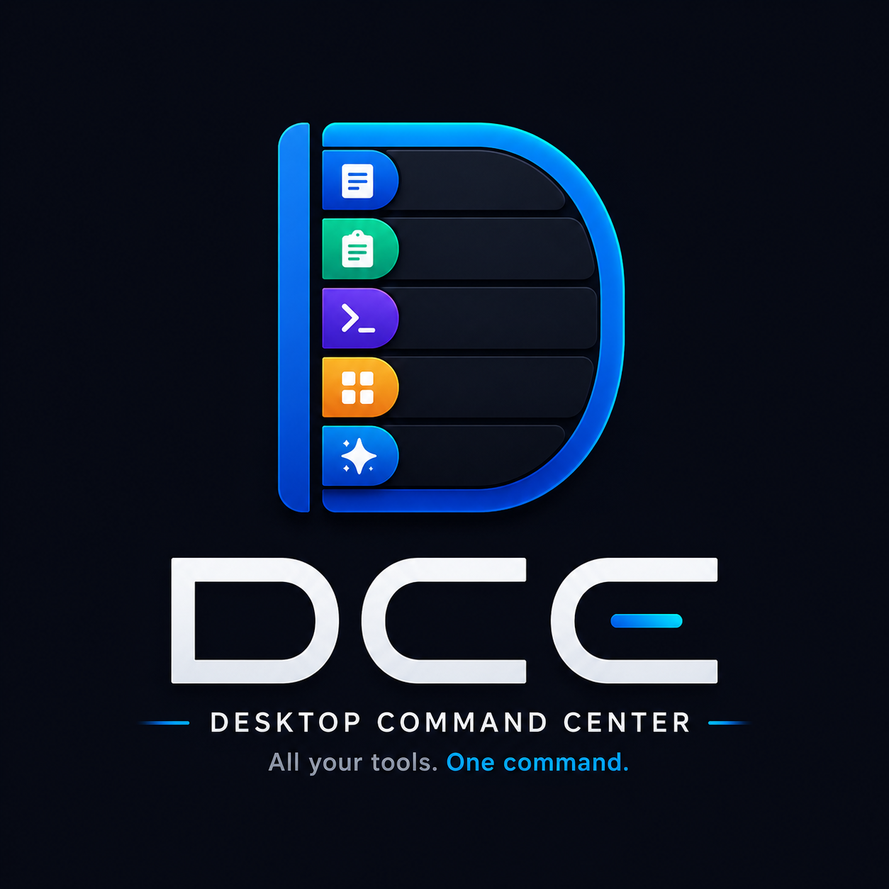

# Desktop Command Center (DCC)

<p align="center">
  
</p>

[](README.md)
[](README.pt-BR.md)
[](README.es.md)

## Product Vision
**Desktop Command Center (DCC)** is an always-accessible, smart sidebar for Windows 11 designed to be a unified productivity hub. It eliminates the need for constant app-switching by bringing the most heavily used daily tools into a single, elegant interface.

Targeted at professionals, developers, content creators, analysts, and power users.

## Philosophy: Local First + Cloud Light
- **Local First**: All user data (Notes, Clipboard history, Settings) remains strictly on the local machine using SQLite. Your content is never uploaded.
- **Cloud Light**: Cloud connectivity (Firebase Auth) is exclusively used as an Identity Provider (Google / GitHub / Microsoft) to link a unique User ID for Stripe licensing/subscriptions. 

## Features (Community / Free)
- ✨ **Fluent Design System**: Built natively for Windows 11 with seamless transparent Mica backdrops and Fluent UI animations.
- 🌍 **Real-Time Localization**: Fully translated interface (English, Portuguese, Spanish).
- 🎨 **Color Picker**: Capture screen colors quickly.
- 📋 **Clipboard (Smart Clipboard)**: A background service that silently captures and stores your clipboard history.
- 📝 **Notes**: Lightning-fast scratchpad embedded in the sidebar.
- 🌙 **Awake**: Keep your PC awake and prevent it from sleeping.
- 📌 **Always on Top**: Pin any window to stay on top.
- 🌐 **Translator**: Instant text translation.
- ⏱️ **Timer**: Built-in stopwatch and timer.
- 🔄 **Update Center**: Keep your app up-to-date easily.
- 🔍 **Universal Search**: Quickly search everything on your system.
- ⌨️ **Command Palette**: Quick CLI commands directly from the UI.
- 💻 **FutureShell**: A robust built-in PTY (Pseudo Console) terminal capable of running PowerShell, CMD, Bash.

## PRO Features (AI & Automation)
- 🤖 **ChatFT (AI Agent)**: A local-first autonomous agent powered by Microsoft Semantic Kernel and Ollama. Includes offline Voice transcription (Whisper) and multi-modal Vision.
- 💬 **Prompt Library**: Complete library of AI prompts.
- ⚙️ **Automations**: Create rule-based visual workflows to execute custom scripts seamlessly across multiple languages.
- ☁️ **Cloud Sync**: Sync notes, hotkeys, automations, and AI to the cloud.
- 👤 **Profiles**: Switch seamlessly between Work, Study, and Personal context profiles.
- 🧩 **Marketplace and Plugins**: (Coming soon) Expand DCC capabilities with community tools.

## Architecture & Technologies
- **Framework**: .NET 9, Windows App SDK (WinUI 3)
- **Design Pattern**: Clean Architecture + MVVM
- **Database**: Entity Framework Core + SQLite
- **Messaging**: MediatR (CQRS Pattern)
- **Dependency Injection**: Microsoft.Extensions.DependencyInjection
- **Auth**: FirebaseAuthentication.net (OAuth)

## Getting Started
### Prerequisites
- Windows 10 (19041) or Windows 11
- .NET 10 SDK
- Visual Studio 2022 (with Windows App SDK workload)

### Build & Run
```bash
# Restore dependencies
dotnet restore DesktopCommandCenter.slnx

# Build the solution
dotnet build DesktopCommandCenter.slnx

# Run the UI Project
dotnet run --project src/DesktopCommandCenter.UI/DesktopCommandCenter.UI.csproj
```

### Packaging & Releases (Velopack)
To generate the one-click installer (`.exe`) and portable zip package (`.zip`) using Velopack, see the [Velopack Packaging Guide](VELOPACK_GUIDE.md) (in Portuguese).

You can also use the automated PowerShell scripts in the root directory:
```powershell
# Build and package the Community version (DCC - Community.exe)
./build_community.ps1 -Version "0.0.1"

# Build and package the PRO version (DCC - PRO.exe)
./build_pro.ps1 -Version "0.0.1"
```

### Docker & Local AI Stack
This repository includes a `docker-compose.yml` to orchestrate the local AI backend (Ollama) and a builder container for the Windows executable.

**1. Run the Local AI Agent (Ollama)**
```powershell
docker-compose up -d ollama
```

**2. Build Releases via Docker (Requires Windows Containers)**
Make sure Docker Desktop is switched to "Windows Containers" to build WinUI 3 applications.
```powershell
# Build Community Edition
docker-compose run --rm build-exe 0.0.2 COMMUNITY

# Build PRO Edition
docker-compose run --rm build-exe 0.0.2 PRO
```

## Security Notice
This project uses Firebase for Identity Management. **Do not commit** Firebase Service Account keys (`.json`) or environment files containing sensitive credentials. The client app only requires the public Web API Key.

## License
Proprietary software. All rights reserved.


### 🤖 On-Demand AI Models
ChatFT now automatically detects if you have models installed in Ollama. If it's your first time, Desktop Command Center will offer options to download and install recommended models (like Phi-3, Llama 3.1, and Gemma 2) with a single click and will display the progress directly in the chat, without needing to touch the terminal!
